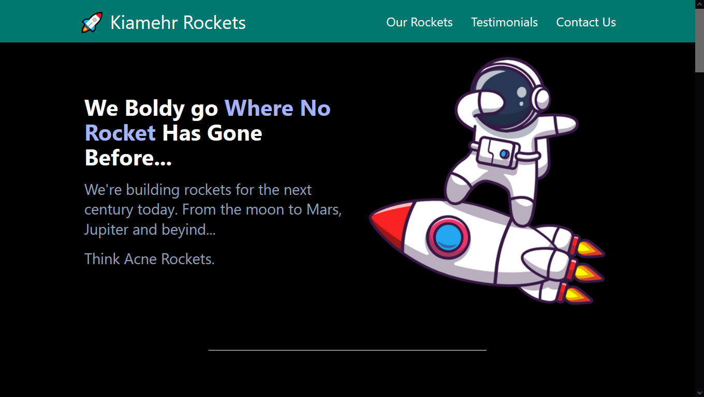

# Tailwind CSS Crash Course – Dave Gray (3 Hour Course)


## About This Repository

This repository contains my practice files, notes, and mini-projects from following  
**Dave Gray’s Tailwind CSS Full Course (3 Hours)**.

It’s part of my **HTML/CSS → Frontend Journey**, where I document everything I learn about modern, utility-first styling using Tailwind.

Here you’ll find step-by-step Tailwind experiments, component recreations, and small UI builds that helped me understand how Tailwind works.

## 🎯 What I Learned

- How Tailwind works (utility classes everywhere)
- Using the CDN and full build workflow
- Responsive design with breakpoints (`sm`, `md`, `lg`, etc.)
- Flexbox and Grid utilities
- Spacing, colors, shadows, borders, typography
- Using and editing `tailwind.config.js`
- Building UI components:
  - Navbars
  - Cards
  - Buttons
  - Forms
  - Responsive sections
- Using Tailwind plugins

## 📁 Structure of This Repo

```text
📦 tailwind-course
┣ 📂 01-Lesson01
┣ 📂 02-Lesson02
┣ 📂 03-Lesson03
┣ 📂 04-lesson04
````

Each folder represents a section from Dave Gray’s course, with my own code experiments added in.

### 2️⃣ Install Tailwind (if using build workflow)

```bash
npm install
npm run build
```

### 3️⃣ Or open the `.html` files directly

Early lessons use the CDN, so you can open them directly in your browser.

## 🖼️ Screenshots

Add screenshots of your components here (cards, navbars, layouts, etc.).

Example:



## 📚 Course Link

This repository is based on Dave Gray’s Tailwind Course:
[https://www.youtube.com/watch?v=lCxcTsOHrjo](https://www.youtube.com/watch?v=lCxcTsOHrjo)

## 🧠 Why I Built This Repo

I’m building a full **frontend journey portfolio**, and this repo helps me show:

* my progress
* my consistency
* my understanding of modern CSS tools
* that I build *while learning*, not just watch tutorials

## 🔗 Connect With Me

* GitHub: [https://github.com/kiyamehr](https://github.com/kiyamehr)
* LinkedIn: [https://www.linkedin.com/in/kiamehr-moradi-005b40398/](https://www.linkedin.com/in/kiamehr-moradi-005b40398/)

---

> “Everything in life takes time
> Spend your time on what truly matters.”
> — Kiamehr

```